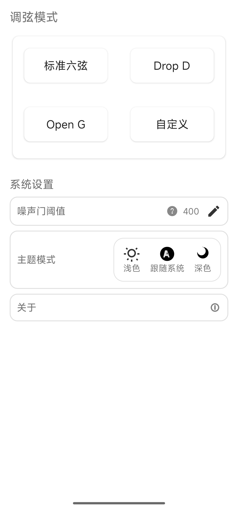
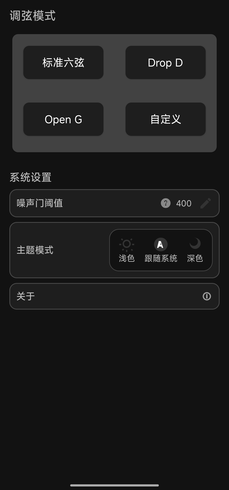
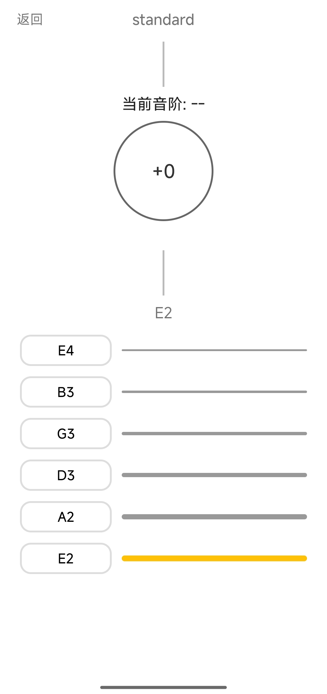
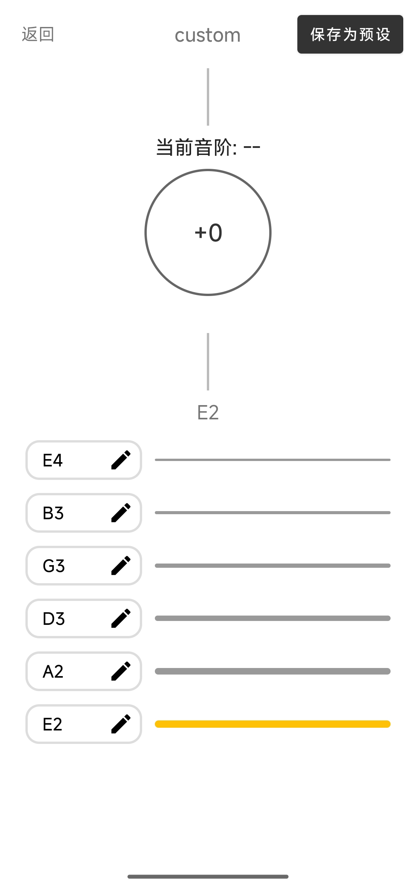
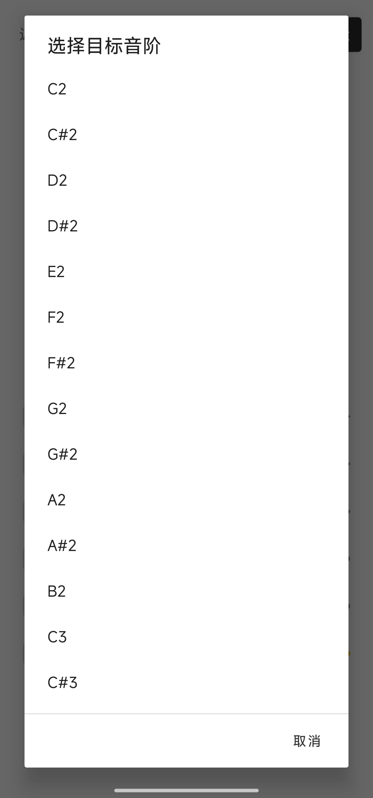

# InTune

[中文](README.md) | English

## Features
- Real-time tuning: capture pitch via microphone, show target/current note and deviation, and guide tune up/down.
- Tuning presets: built-in Standard, Drop D, Open G, plus custom presets you can save.
- Sensitivity threshold: adjustable tolerance with inline help.
- Theme switching: Light, Dark, and System.
- Easy feedback: About page links to GitHub and copies support email to clipboard.

## Demo screenshots

> Real device screenshots placed at the repo root.
<table>
  <tr>
    <td width="25%"></td>
    <td width="5%"></td>
    <td width="25%"></td>
    <td width="5%"></td>
    <td width="25%"></td>
  </tr>
  <tr>
    <td width="25%"></td>
    <td width="5%"></td>
    <td width="25%"></td>
    <td width="5%"></td>
    <td width="25%"></td>
  </tr>
</table>

## Download
- See latest and previous releases: https://github.com/brassface/InTune/releases
- Grab APK from Release Assets: `InTune_*.apk`

## Install
- Enable "install from unknown sources" on your device
- Copy APK to the phone and tap to install

## Compatibility
- Min SDK: Android 5.0 (API 21)
- Target SDK: API 30 (`targetSdkVersion = 30`)

## Environment and tool versions
- JDK: 1.8.0_361 (Java 8)
- Gradle: 6.7.1 (via project wrapper)
- Android SDK: `compileSdkVersion = 30`
- `minSdkVersion = 21`
- `targetSdkVersion = 30`

Verify locally (optional):
```bash
./gradlew -v      # Gradle version & JDK info
java -version     # JDK version
```

## Build locally
```bash
# Clone via SSH
git clone git@github.com:brassface/InTune.git
cd InTune

# Debug build (unsigned)
./gradlew assembleDebug
```

Artifacts:
- Debug: `app/build/outputs/apk/debug/app-debug.apk`

 

## Versioning & Release
- Version name: `defaultConfig.versionName` in `app/build.gradle.kts`
- Publish to GitHub:
  1. `git tag vX.Y.Z && git push origin vX.Y.Z`
  2. Create a Release at https://github.com/brassface/InTune/releases/new and upload the APK as an asset

## Contributing
Issues and PRs are welcome.

