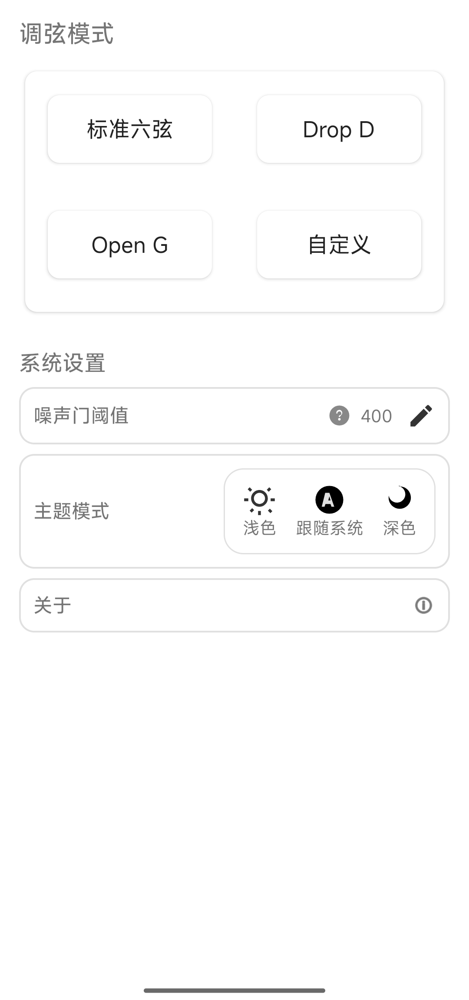

# 合调 (InTune)

中文 | [English](README.en.md)

## 功能
- 实时调音：通过麦克风采集音高，显示目标音、当前音与音高偏差，并提示应升/应降。
- 调弦预设：内置标准、Drop D、Open G，可创建并保存自定义预设。
- 灵敏度阈值：可调整调音判定阈值，并提供阈值说明与引导。
- 主题切换：支持亮色、暗色、跟随系统三种主题。
- 便捷反馈：关于页一键跳转 GitHub，点击复制反馈邮箱到剪贴板。

## 演示截图

> 以下为应用实机运行截图。
<table>
  <tr>
    <td width="25%"></td>
    <td width="5%"></td>
    <td width="25%"></td>
    <td width="5%"></td>
    <td width="25%"></td>
  </tr>
  <tr>
    <td width="25%"></td>
    <td width="5%"></td>
    <td width="25%"></td>
    <td width="5%"></td>
    <td width="25%"></td>
  </tr>
</table>

## 下载
- 最新版本与历史版本请见 [Releases](https://github.com/brassface/InTune/releases)
- 直接下载 APK：在对应 Release 的 Assets 中获取 `InTune_*.apk`

## 安装
- 在手机上开启“允许安装未知来源应用”
- 将 APK 拷贝到手机后点击安装

## 兼容性
- 最低版本：Android 5.0（API 21）
- 目标版本：API 30（`targetSdkVersion = 30`）

## 环境与工具版本
- JDK：1.8.0_361（Java 8）
- Gradle：6.7.1（使用仓库自带 wrapper）
- Android SDK：`compileSdkVersion = 30`
- `minSdkVersion = 21`
- `targetSdkVersion = 30`

检查本地版本（可选）：
```bash
./gradlew -v      # 查看 Gradle 版本与 JDK
java -version     # 查看 JDK 版本
```

## 本地构建
```bash
# 克隆代码（SSH）
git clone git@github.com:brassface/InTune.git
cd InTune

# 调试构建（未签名）
./gradlew assembleDebug
```

生成产物位置：
- 调试包：`app/build/outputs/apk/debug/app-debug.apk`

 

## 版本与发布
- 版本名在 `app/build.gradle.kts` 的 `defaultConfig.versionName`
- 发布到 GitHub：
  1. `git tag vX.Y.Z && git push origin vX.Y.Z`
  2. 前往 [Releases](https://github.com/brassface/InTune/releases/new) 创建 Release，上传 APK 作为附件

## 贡献
欢迎提交 Issue / PR 改进文档与功能。


